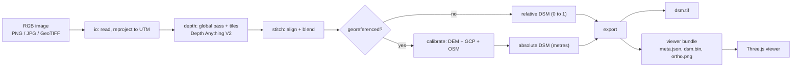

# Architecture

## Pipeline



## Repo layout

```
depthwizard/                  repo root
├── CLAUDE.md
├── README.md
├── docs/
├── configs/                  default.yaml, eval_quick.yaml, ...
├── depthwizard/              Python package: the pipeline
│   ├── __main__.py           CLI: python -m depthwizard run ...
│   ├── config.py             one dataclass, loaded from configs/*.yaml
│   ├── io/                   read_image, reproject_to_utm, write_geotiff
│   ├── depth/                model.py, tiling.py, stitch.py, polarity.py
│   ├── calibrate/            dem.py, fit.py, gcp.py, osm.py, prior.py
│   ├── export/               bundle.py, preview.py, synthetic.py
│   └── pipeline.py           run(input, options) -> Result
├── api/                      FastAPI: jobs, bundles, validate, static viewer
├── evals/                    datasets/, splits/, run.py, metrics.py, REPORT.md, results/
├── viewer/                   Three.js (from ChatGPT, see VIEWER_CONTRACT.md)
├── desktop/                  Tauri shell + sidecar config
├── tests/
└── data/                     gitignored: models/, cache/, datasets/, samples/, jobs/
```

## Stage 1: Input

- Accept .png .jpg .jpeg .tif .tiff. Read everything with rasterio.
- Georeferenced means the file has a CRS and a non-identity transform.
- If the CRS is geographic (EPSG:4326 and similar), reproject to the UTM zone of the scene center using bilinear resampling, keeping the native ground resolution. After this step pixels are square and measured in metres.
- 16-bit or multi-band input: take bands 1, 2, 3 as RGB (configurable), stretch each to 8-bit using its 2nd to 98th percentile, and log that it happened.
- If the longest side exceeds 12000 px (config), downsample and warn.

## Stage 2: Relative depth

**Model.** `depth-anything/Depth-Anything-V2-Small-hf` through transformers: fp16 on CUDA, fp32 on CPU, loaded from data/models/. The output is relative inverse depth. For a top-down image, larger means closer to the camera, which means taller. Run `polarity.py` on each new dataset to confirm. Licensing: Small is Apache-2.0, and the bigger checkpoints carry a non-commercial license. Check the model card before switching.

**Global pass.** Resize the whole image so its long side is 1036 px (a multiple of the 14 px patch size) and predict. Upsample the result to full resolution; call it G.

**Tiles.** 518×518 at native resolution, stride 259 (50% overlap). Batch as VRAM allows; start at 8 in fp16.

**Alignment.** For each tile prediction t, solve for α and β that minimize ‖α·t + β − G_tile‖², dropping the 5% largest residuals. Replace t with α·t + β.

**Blending.** Accumulate each aligned tile times a 2D Hann window, then divide by the summed weights.

**Output.** `d`: float32, full resolution, arbitrary units, larger = higher.

Worth trying and logging (not required): 1036 px tiles on a 2× upsampled input; Base instead of Small.

## Stage 3a: Relative mode (no georeference)

- rDSM = (d − p1) / (p99 − p1), clipped to [0, 1], where p1 and p99 are percentiles of d.
- Optional user inputs: ground sample distance (m/px) and one or more "this point is H metres above ground" anchors. With both, fit a scale and output approximate metres with `calibration.method = "user_anchor"` and confidence `low`.

## Stage 3b: Calibration (georeferenced)

**Inputs:**
- d, from Stage 2
- D: the DEM resampled onto the image grid (bilinear, metres), converted to EGM2008 heights when the source is ellipsoidal (CartoDEM V3R1; geoid grid from `scripts/fetch_geoid.py`)
- optional GCPs (CSV `x,y,height_m` in the image CRS, or `lon,lat,height_m`)
- optional OSM building footprints with height tags (fetched once, cached)

**Band split.**
- d_low = gaussian(d, σ), with σ = k · dem_res / pixel_size. k = 1.0, tuned on val (config; tune per DEM on val); the physical argument below gives 0.5, and val preferred 1.0 by a small margin once the DEM-band scale was in place.
- d_high = d − d_low
- Why 0.5 and not the original 1.5: D reaches the image grid as a dem_res area average followed by bilinear resampling, which blurs by about 0.5 · dem_res. σ should match that blur. A wider σ puts the band between the two scales (large buildings, blocks) in both D and d_high, so it's counted twice; the synthetic tests in tests/test_calibrate.py show exactly that. Blurrier DEMs (SRTM) may want a larger k: tune it on val, per DEM source.

**Method A: global affine (baseline).** Downsample d to the DEM grid by area averaging, and fit D ≈ a·d + b with a Huber loss. DSM_A = a·d + b. This is simple, but it breaks on hilly scenes, where the model mixes up slope and height.

**Method B: terrain + detail (default).** DSM_B = D + s·d_high.

The idea: a surface DEM at 30 m is roughly a low-pass version of the true surface, so the model only has to supply the high-frequency part. This works best with a surface model (Copernicus GLO-30, CartoDEM, SRTM). A bare-earth DEM will under-predict dense built-up areas.

Take the scale s from the first source available:

1. **GCPs.** Height above D at each point versus d_high at that point; least-squares fit for s.
2. **OSM buildings** tagged `height` or `building:levels` (levels × 3.0 m, config). For each building, take the median d_high inside its footprint and compare it to the tagged height. s is the median ratio. Needs at least 10 buildings. *(Not built: cut-list #2.)*
3. **DEM band.** The DEM itself resolves detail from its cell size up to a few cells. Area-average d and D to DEM cells, high-pass both with the same Gaussian (`band_coarse_cells`), and regress D's detail on d's. Use the slope as s only if the two correlate (`band_min_r`) over enough cells (`band_min_cells`). This is the only scene-specific source that needs no extra input; where the model disagrees with the terrain it adds nothing instead of noise.
4. **DEM relief.** If std(D) > `dem_relief_std_m`, use a from Method A.
5. **Scene prior.** Assume the 98th percentile of d_high corresponds to a fixed height (config; tune on the val split only). A zero height means "add no detail": the DSM is then D. Confidence low.

Record the source in `calibration.method` and a confidence of `high` (GCPs), `medium` (OSM, DEM band or DEM relief), or `low` (prior or DEM only).

Tuning (`python -m evals.tune`) sweeps these settings on the val split in scene mode: each site's whole scene is calibrated, as for a user upload.

**Output.** Float32 GeoTIFF, nodata −9999, LZW compression, with tags `DW_MODE`, `DW_CAL_METHOD`, `DW_CAL_CONFIDENCE`, `DW_DEM_SOURCE`, `DW_VERSION`.

## Stage 4: Export for the viewer

Follow VIEWER_CONTRACT.md exactly.
- Downsample the viewer DSM by area averaging so the longest side is at most 2048.
- Cap the ortho at 4096 on its long side.
- Fill NaN gaps from the nearest valid pixel before writing dsm.bin, and write mask.png marking what was filled.

## API

| Method | Path | What it does |
|---|---|---|
| POST | /api/jobs | multipart `image`, optional `dem`, `gcps`, `gsd_m`, `anchors`. Returns `{job_id}` |
| GET | /api/jobs/{id} | `{status, stage, progress, message}` |
| GET | /api/jobs/{id}/bundle/{file} | meta.json, dsm.bin, ortho.png, mask.png, error.bin |
| GET | /api/jobs/{id}/dsm.tif | full-resolution DSM GeoTIFF |
| POST | /api/jobs/{id}/validate | multipart `reference` GeoTIFF. Returns metrics, writes error.bin |
| GET | /api/jobs | finished results, newest first (the viewer's terrain switcher) |
| GET | /api/health | `{ok, gpu, model_loaded}` |

Jobs run one at a time in a background worker, since there's one GPU. Job files live in data/jobs/{id}/. There's no auth; it's a local app. The model loads once at startup, not per job.

## Config

Every tunable lives in configs/default.yaml and one dataclass in depthwizard/config.py. Each eval run saves a copy of the config it used.

## Performance targets (RTX 4060, 4000×4000 input)

| Stage | Target |
|---|---|
| Model load | under 10 s, once at startup |
| Depth + stitch | under 90 s |
| Calibration | under 15 s, not counting the first DEM download |
| Export | under 5 s |

Log actual times per stage in each job's log. The runtime table in REPORT.md comes from these logs.

## Known failure cases

- **Water.** Model output over water is noise. Possible fix: where local texture variance is very low, fall back to the DEM value. Measure before building it.
- **Shadows.** Dark areas read as low ground.
- **Off-nadir imagery.** Tall buildings lean, so rooftop height lands beside the footprint. Record the view angle when the metadata has it.
- **Flat, featureless farmland.** The model may invent relief. Method B falls back to low confidence here.
