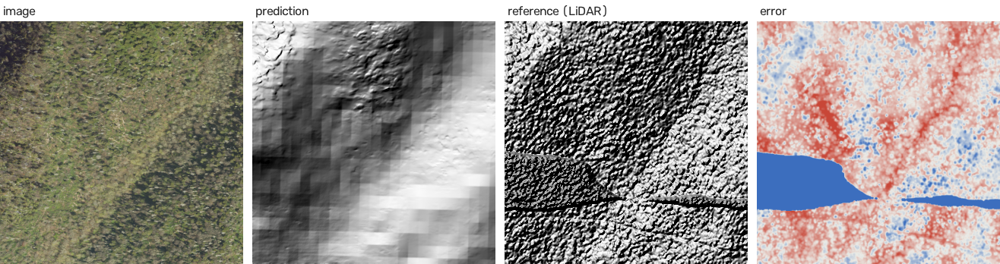
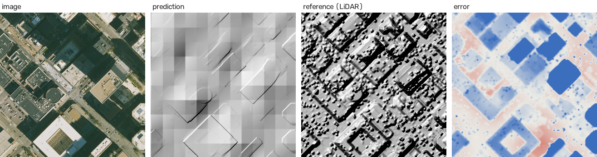
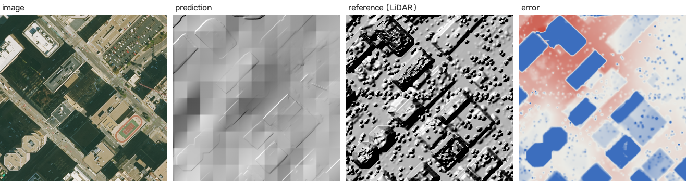
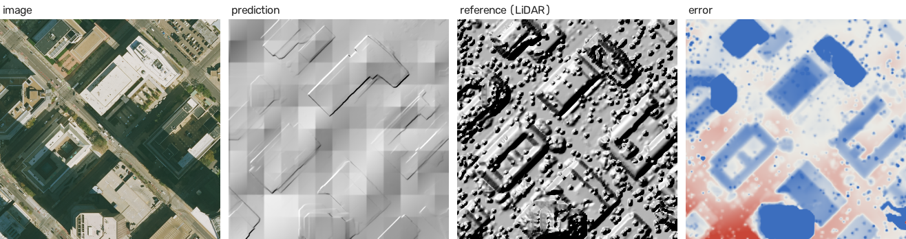
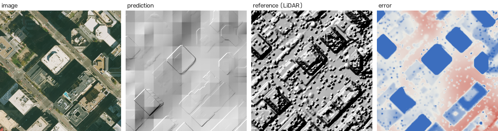

# DepthWizard evaluation report

Generated by `python -m evals.run --split full`. Do not edit by hand; failure causes go in `evals/failure_causes.yaml`.

## Table 1: accuracy by landscape

Metres. Each value is the mean of per-tile values over the landscape's test tiles. Truth: USGS 3DEP LiDAR DSM (NAVD88). Calibration DEM: Copernicus GLO-30 (EGM2008), so raw RMSE and bias include a datum offset; offset-free RMSE removes it. nDSM RMSE is measured on buildings and trees only (reference height above ground > 2.5 m).

| Landscape | Method | Tiles | RMSE | MAE | r | Bias | NMAD | Offset-free RMSE | nDSM RMSE |
|---|---|---|---|---|---|---|---|---|---|
| urban | DEM only | 24 | 17.83 | 9.07 | 0.388 | -5.79 | 5.92 | 17.51 | 24.95 |
| urban | Method A | 24 | 20.16 | 12.05 | 0.323 | -6.35 | 7.38 | 18.59 | 26.88 |
| urban | Method B | 24 | 17.62 | 8.89 | 0.425 | -5.78 | 5.73 | 17.26 | 24.69 |
| sparse | DEM only | 12 | 1.19 | 1.01 | 0.999 | -0.97 | 0.51 | 0.68 | 5.28 |
| sparse | Method A | 12 | 28.08 | 24.88 | 0.026 | -13.57 | 16.39 | 15.51 | 15.17 |
| sparse | Method B | 12 | 1.19 | 1.02 | 0.999 | -0.97 | 0.53 | 0.68 | 3.99 |
| hilly | DEM only | 12 | 3.28 | 2.55 | 0.994 | 0.07 | 2.93 | 3.15 | 3.38 |
| hilly | Method A | 12 | 61.36 | 54.11 | 0.275 | 7.57 | 34.30 | 31.91 | 58.72 |
| hilly | Method B | 12 | 3.28 | 2.55 | 0.994 | 0.07 | 2.93 | 3.15 | 3.38 |
| forested | DEM only | 24 | 12.28 | 7.01 | 0.955 | 2.57 | 4.66 | 10.68 | 12.32 |
| forested | Method A | 24 | 90.29 | 81.94 | 0.291 | 13.61 | 47.49 | 45.28 | 89.75 |
| forested | Method B | 24 | 12.14 | 6.91 | 0.956 | 2.59 | 4.61 | 10.52 | 12.26 |
| all | DEM only | 72 | 10.78 | 5.95 | 0.780 | -1.22 | 4.10 | 10.03 | 15.25 |
| all | Method A | 72 | 51.72 | 44.50 | 0.255 | 1.42 | 26.74 | 29.19 | 57.00 |
| all | Method B | 72 | 10.67 | 5.86 | 0.792 | -1.21 | 4.02 | 9.90 | 15.09 |

## Table 1b: relative mode (GAMUS, scale-aligned)

Relative DSMs have no metres. They are fitted to the reference height above ground with a least-squares scale and shift, then scored. These numbers are **scale-aligned**.

| Dataset | Tiles | Scale-aligned RMSE (m) | Scale-aligned MAE (m) | r |
|---|---|---|---|---|
| GAMUS test | 60 | 5.30 | 4.23 | 0.420 |

## Table 2: runtime per pipeline stage

Mean over 6 site scenes (4096x4096 px) on cuda:NVIDIA GeForce RTX 5060 Laptop GPU; the DEM is read from the local cache.

| Stage | Seconds per scene |
|---|---|
| depth + stitch | 6.50 |
| calibrate | 0.80 |

## Failure gallery: the 5 worst tiles (Method B RMSE)

### naip3dep/smokies/3_0 (forested)

RMSE 123.68 m · NMAD 7.22 m · scale source dem_band

Cause: _Cause not written yet: add it to evals/failure_causes.yaml._

### naip3dep/denver/3_3 (urban)

RMSE 41.54 m · NMAD 12.38 m · scale source dem_band

Cause: _Cause not written yet: add it to evals/failure_causes.yaml._

### naip3dep/denver/2_3 (urban)

RMSE 37.83 m · NMAD 13.57 m · scale source dem_band

Cause: _Cause not written yet: add it to evals/failure_causes.yaml._

### naip3dep/denver/1_3 (urban)

RMSE 37.25 m · NMAD 9.80 m · scale source dem_band

Cause: _Cause not written yet: add it to evals/failure_causes.yaml._

### naip3dep/denver/1_2 (urban)

RMSE 35.61 m · NMAD 10.49 m · scale source dem_band

Cause: _Cause not written yet: add it to evals/failure_causes.yaml._

---
Run `full-20260911-145944` · commit `uncommitted` (uncommitted changes) · config `results/full-20260911-145944/config.yaml`
